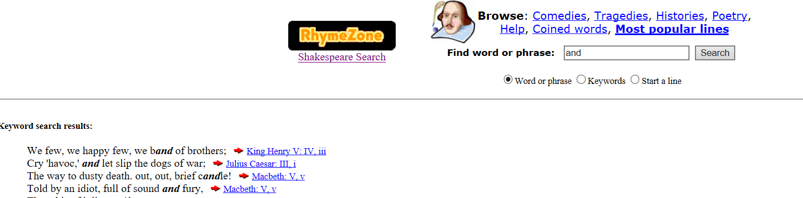
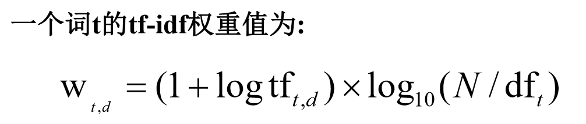
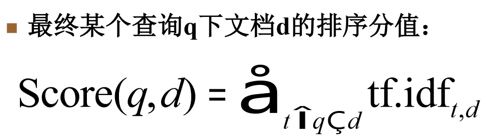
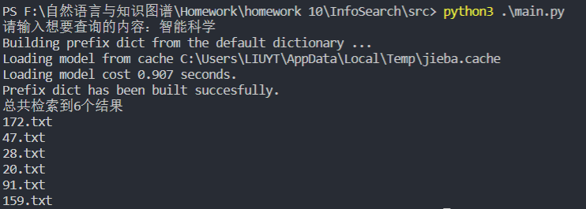
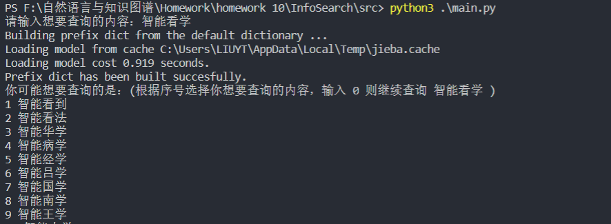
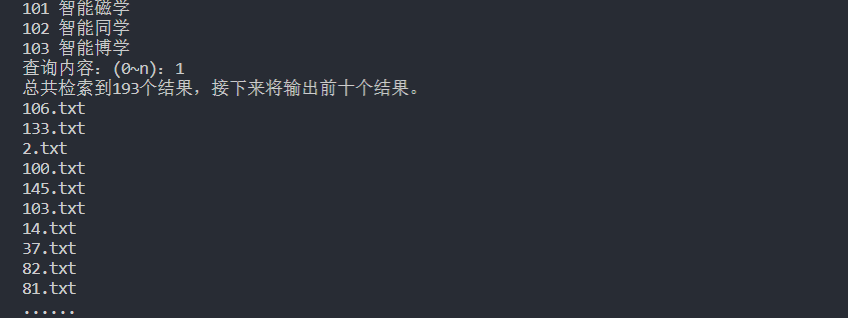

# 信息检索系统

## 介绍

> 参考：[http://www.rhymezone.com/shakespeare/](http://www.rhymezone.com/shakespeare/)
>
> 

实现简单的搜索引擎功能，实现以下基本功能： 

1.  拼写检查（参考最小编辑距离原理） 
2. 倒排索引 
3. 使用TF/IDF进行文档排序

> 数据来源：data文件夹是从百度百科词条中抽取的文本，作为文档语料

##  实现

### 倒排索引

* 步骤
  * jieba分词，过滤标点符号
  * 建立[倒排索引](https://baike.baidu.com/item/倒排索引/11001569?fr=aladdin)

### 拼写检查

* 参考最短编辑距离实现
* 实现步骤：
  * 查询内容分词
  * 查找对应的词是否存在
    * 存在，则不进行额外检查
    * 不存在，检索词库，查找所有与该词编辑距离为1的词
  * 将可能的模糊词进行组合，提供查询选择

### TF/IDF进行文档排序

## 结果

* 示例 一

  

* 示例 二

  

  

## 使用说明

* 运行 - `python3 src/main.py`
* `index/index.json`为已经生成的倒排索引，可以考虑调用`load_inverted_index`方法加载已经生成的倒排索引，或者利用`create_index`创建新的倒排索引

* 拼写检查关于推荐的相关效果不是很好，可以考虑建立词库，为不同的词的组合设定权重，这样相关的推荐更加合理